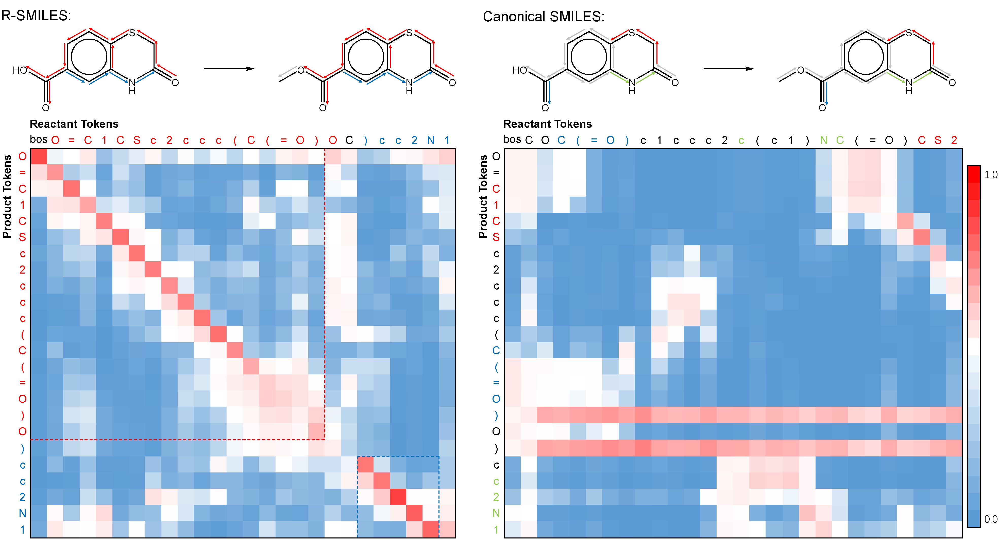

# Root-aligned SMILES: A Tight Representation for Chemical Reaction Prediction

 

 [[arxiv](https://arxiv.org/abs/2203.11444)]

The directory contains source code of the unpublished article:
Zhong et al's Root-aligned SMILES: A Tight Representation for Chemical Reaction Prediction.

In this work, we propose root-aligned SMILES (R-SMILES), which specifies a tightly aligned one-to-one mapping between the product and the reactant SMILES, to narrow the string representation discrepancy for more efficient retrosynthesis.
Here we provide the source code of our method.

## Data and Model

USPTO-50K: https://github.com/Hanjun-Dai/GLN

USPTO-MIT: https://github.com/wengong-jin/nips17-rexgen/blob/master/USPTO/data.zip

USPTO-FULL: https://github.com/Hanjun-Dai/GLN

Our augmented datasets, checkpoints and 200 examples of attention maps: https://drive.google.com/drive/folders/1c15h6TNU6MSNXzqB6dQVMWOs2Aae8hs6?usp=sharing

## Environment Preparation

Please make sure you have installed anaconda. The version about `pytorch` and `cudatoolkit` should be depended on your machine. The version of `pytorch` should not be smaller than 1.6 according to the OpenNMT-py.

```shell
conda create -n r-smiles python=3.7 \
conda activate r-smiles \
conda install pytorch==1.10.1 torchvision==0.11.2 torchaudio==0.10.1 cudatoolkit=11.3 -c pytorch -c conda-forge \
pip install pandas==1.3.4 \
pip install torchtext==0.5.0 \
pip install textdistance==4.2.2 \
conda install rdkit=2020.09.1.0 -c rdkit \
pip install OpenNMT-py==2.2.0
```


## Overview of the workflow

We follow the OpenNMT architecture to train the Transformer. The workflow is

* generate the dataset with root alignment and data augmentation;
* build the vocab based on the dataset;
* start training;
* averaging the checkpoints to get the final checkpoint.
* choose a checkpoint to make model predictions.
* score the prediction to get the accuracy.

We have placed all the config files in the `pretrain_finetune` and `train-from-scratch` folders and categorized by task. You can use config files directly with OpenNMT commands or modify them according to your needs (such as different datasets or using our prepared checkpoints).

## Data preprocessing

* Step 1: You should download the dataset and put them like this:

  ```shell
  USPTO-50K: dataset/USPTO_50K/raw_train.csv
  USPTO-MIT: dataset/USPTO-MIT/train.txt
  USPTO_full: dataset/USPTO_full/raw_train.csv
  ```

* Step 2: Generate the pretrain data with data augmentation (you can skip this step if you want to train from scratch)

  ```shell
  python preprocessing/generate_pretrain_data.py.py \
  	-mode <reactant only or product only or both of them> \
      -augmentation <times of augmentation>
  python preprocessing/generate_masked_pretrain_data.py \
  	-dataset <the dataset your want>
  ```

  Here is the example for using the product molecules in USPTO_full:

  ```shell
  python preprocessing/generate_pretrain_data.py -mode product -augmentation 5
  python preprocessing/generate_masked_pretrain_data.py -dataset USPTO_full_pretrain_aug5_product
  ```


* Step 3: Generate the dataset with root alignment and data augmentation

  ```shell
  python preprocessing/generate_PtoR_data.py \
  	-dataset <the dataset you want> \
      -augmentation <times of augmentation> \
      -processes <number of process you want to use. Higher is faster.>
  ```

  Here is the example for different datasets:

  ```shell
  python preprocessing/generate_PtoR_data.py -dataset USPTO_50K -augmentation 20 -processes 8
  python preprocessing/generate_PtoR_data.py -dataset USPTO-MIT -augmentation 5 -processes 8
  python preprocessing/generate_PtoR_data.py -dataset USPTO_full -augmentation 5 -processes 8
  ```

  It is the same procedure for  `generate_RtoP_data` and `generate_PtoStoR_data`.


  ```shell
  python preprocessing/generate_RtoP_data.py -dataset USPTO-MIT -augmentation 5 -processes 8 -separated
  python preprocessing/generate_RtoP_data.py -dataset USPTO-MIT -augmentation 5 -processes 8 -postfix _mixed
  python preprocessing/generate_PtoStoR_data.py -dataset USPTO_50K -augmentation 20 -processes 8
  ```


## Pretrain and Finetune

​	(**If you want to pretrain the model, you should also generate all the finetune datasets in advance to build a full vocab.**)

* Step 1 (Pretrain): Just run the prepared shell command to start pretraining according to your pretrain dataset.

  ```shell
  bash shell_cmds/product_pretrain.sh
  bash shell_cmds/reactant_pretrain.sh
  bash shell_cmds/both_pretrain.sh
  ```

  For example, if you want to pretrain the datasets that contains product molecules only, you should run the first command.

* Step 2 (Finetune): Run the OpenNMT train command with the prepared parameter config file. If you want to use different checkpoint to finetune the model,  you should modify `train_from` parameter in the corresponding config file.

  ```shell
  onmt_train -config pretrain_finetune/finetune/PtoR/PtoR-50K-aug20-config.yml
  onmt_train -config pretrain_finetune/finetune/PtoR/PtoR-MIT-aug5-config.yml
  onmt_train -config pretrain_finetune/finetune/PtoR/PtoR-Full-aug5-config.yml
  onmt_train -config pretrain_finetune/finetune/RtoP/RtoP-MIT-mixed-aug5-config.yml
  onmt_train -config pretrain_finetune/finetune/RtoP/RtoP-MIT-separated-aug5-config.yml
  ```

* Step 3 (Average): Run the prepared shell command to average the checkpoints and get the final checkpoint. You can modify the corresponding shell command to average different checkpoints.

  ```shell
  bash pretrain_finetune/finetune/PtoR/PtoR-50K-aug20-average.sh
  bash pretrain_finetune/finetune/PtoR-MIT-aug5-average_models.sh
  bash pretrain_finetune/finetune/PtoR-Full-aug5-average_models.sh
  bash pretrain_finetune/finetune/RtoP/RtoP-MIT-mixed-aug5-average_models.sh
  bash pretrain_finetune/finetune/RtoP/RtoP-MIT-separated-aug5-average_models.sh
  ```

## Train from scratch

* Step 1: Just run the prepared shell command to start training according to your task.

  ```shell
  bash shell_cmds/p2r_50k_from_scratch.sh
  bash shell_cmds/p2r_MIT_from_scratch.sh
  bash shell_cmds/p2r_full_from_scratch.sh
  bash shell_cmds/r2p_MIT_mixed_from_scratch.sh
  bash shell_cmds/r2p_MIT_separated_from_scratch.sh
  bash shell_cmds/p2s_50k_from_scratch.sh
  bash shell_cmds/s2r_50k_from_scratch.sh
  ```

* Step 2: Run the prepared shell command to average the checkpoints and get the final checkpoint. You can modify the corresponding shell command to average different checkpoints.

  ```shell
  bash train-from-scratch/PtoR/PtoR-50K-aug20-average.sh
  bash train-from-scratch/PtoR/PtoR-MIT-aug5-average_models.sh
  bash train-from-scratch/PtoR/PtoR-Full-aug5-average_models.sh
  bash train-from-scratch/RtoP/RtoP-MIT-mixed-aug5-average_models.sh
  bash train-from-scratch/RtoP/RtoP-MIT-separated-aug5-average_models.sh
  bash train-from-scratch/PtoS/PtoS-50K-aug20-average.sh
  bash train-from-scratch/StoR/StoR-50K-aug20-average.sh
  ```

## Translate and score

### P2R / R2P / P2S  /  S2R

* Step 1: Run the OpenNMT translate command with the prepared parameter config file. If you want to use different checkpoint,  you should modify `model` parameter in the corresponding config file.

  For example, if you want to make retrosynthesis predictions with a train-from-scratch checkpoint for USPTO-50K, you should run the following commands:

  ```shell
  onmt_translate -config train-from-scratch/PtoR/PtoR-50K-aug20-translate.yml
  ```

* Step 2: Score the predictions.

  ```shell
  python score.py \
  	-beam_size	<the beam_size when translating, default is 10> \
  	-n_best	<the n_best when translating, default is 10> \
  	-augmentation <times of augmentation when making predictions> \
  	-predictions <the path of the prediction result> \
  	-targets <the path of the augmented target> \
  	-process_number <number of process you want to use. Higher is faster.> \
  	-score_alpha <weighting the number of occurrences and ranking, default is 1> \
  	-save_file <save the final prediction resutls>
  	-detailed <if you want to see the detailed accuracy like chirality, set it True> \
  	-source <is only needed if the detailed is true. the path of augmented source> \
  	-synhton <if you want to calculate the accuracy of synthons, set it True>
  ```

  Here is an example for scoring the USPTO-50K when making prediction with 20 times augmentation:

  ```shell
  python score.py \
  	-beam_size 10 \
  	-n_best 10 \
  	-augmenation 20 \
  	-targets ./dataset/USPTO_50K_PtoR_aug20/test/tgt-test.txt \
  	-predictions ./exp/USPTO_50K_PtoR_aug20/average_model_56-60-results.txt \
  	-process_number 8\
  	-score_alpha 1 \
  	-save_file ./final_results.txt
  	-detailed
  	-source ./dataset/USPTO_50K_PtoR_aug20/test/src-test.txt
  ```

### P2S2R

* Step 1:  Get the predictions of P2S stage:

  ```shell
  onmt_translate -config train-from-scratch/PtoS/PtoS-50K-aug20-translate.yml
  ```

* Step 2:  Select top-k synthons to preform data augmentation for S2R stage:

  ```shell
  python preprocessing/prepare_StoR.py \
  	-ptos_src ./dataset/USPTO_50K_P2S2R_aug20/P2S/test/src-test.txt
  	-ptos_results exp/USPTO_50K_P2S2R_aug20/P2S/average_model_96-100-results.txt \
  	-ptos_beam_size 10 \
  	-ptos_topk 3 \
  	-stor_targets ./dataset/USPTO_50K_P2S2R_aug20/S2R/test/tgt-test.txt \
  	-augmentation 20 \
  	-save_dir ./dataset/USPTO_50K_P2S2R_aug20/S2R/test/
  ```

* Step 3: Get the predictions of P2S2R:

  ```shell
  onmt_translate -config train-from-scratch/StoR/PtoStoR-50K-aug20-translate.yml
  ```


* Step 4:  Score the predictions.

  ```shell
  python score_p2s2r.py \
  	-beam_size	<the beam_size when translating, default is 10> \
  	-n_best	<the n_best when translating, default is 10> \
  	-augmentation <times of augmentation when making S2R predictions> \
  	-predictions <the path of the prediction result> \
  	-ptos_topk <should be same as the `prepare_StoR`>
  	-targets <the path of the augmented target> \
  	-process_number <number of process you want to use. Higher is faster.> \
  	-save_file <save the final prediction resutls>
  ```


## Generate your own R-SMILES

* Simply prepare your atom mapped reaction and run the following script. If your reaction is without atom mapping, we recommend you to use Indigo or RXNmapper tools to get it.

  ```shell
  python preprocessing/get_R-SMILES.py \
  	-rxn <atom mapped rxn>
  	-mode <'retro' or 'forward'>
  	-forewad_mode <'separated' or 'mixed'>
  	-augmenation <times of augmentation>
  ```


* Here is an example to run the script and results:

  ```shell
  python preprocessing/get_R-SMILES.py -rxn '[O:1]=[N+:2]([O-:3])[c:4]1[cH:5][c:6]([CH2:7][OH:8])[cH:9][cH:10][c:11]1[F:12]>>[O:1]=[N+:2]([O-:3])[c:4]1[cH:5][c:6]([CH:7]=[O:8])[cH:9][cH:10][c:11]1[F:12]' \
  -augmentation 10

  Namespace(augmentation=10, forward_mode='separated', mode='retro', processes=-1, rxn='[O:1]=[N+:2]([O-:3])[c:4]1[cH:5][c:6]([CH2:7][OH:8])[cH:9][cH:10][c:11]1[F:12]>>[O:1]=[N+:2]([O-:3])[c:4]1[cH:5][c:6]([CH:7]=[O:8])[cH:9][cH:10][c:11]1[F:12]', seed=33)
  Original input: [O:1]=[N+:2]([O-:3])[c:4]1[cH:5][c:6]([CH:7]=[O:8])[cH:9][cH:10][c:11]1[F:12]
  Original output: [O:1]=[N+:2]([O-:3])[c:4]1[cH:5][c:6]([CH2:7][OH:8])[cH:9][cH:10][c:11]1[F:12]
  Canonical input: O=Cc1ccc(F)c([N+](=O)[O-])c1
  Canonical output: O=[N+]([O-])c1cc(CO)ccc1F
  ID:0
  R-SMILES input:O=Cc1ccc(F)c([N+](=O)[O-])c1
  R-SMILES output:OCc1ccc(F)c([N+](=O)[O-])c1
  ID:1
  R-SMILES input:O=Cc1ccc(F)c([N+](=O)[O-])c1
  R-SMILES output:OCc1ccc(F)c([N+](=O)[O-])c1
  ID:2
  R-SMILES input:c1([N+](=O)[O-])cc(C=O)ccc1F
  R-SMILES output:c1([N+](=O)[O-])cc(CO)ccc1F
  ID:3
  R-SMILES input:C(=O)c1ccc(F)c([N+](=O)[O-])c1
  R-SMILES output:C(O)c1ccc(F)c([N+](=O)[O-])c1
  ID:4
  R-SMILES input:c1cc(F)c([N+](=O)[O-])cc1C=O
  R-SMILES output:c1cc(F)c([N+](=O)[O-])cc1CO
  ID:5
  R-SMILES input:c1c(C=O)ccc(F)c1[N+](=O)[O-]
  R-SMILES output:c1c(CO)ccc(F)c1[N+](=O)[O-]
  ID:6
  R-SMILES input:c1(C=O)ccc(F)c([N+](=O)[O-])c1
  R-SMILES output:c1(CO)ccc(F)c([N+](=O)[O-])c1
  ID:7
  R-SMILES input:c1(F)ccc(C=O)cc1[N+](=O)[O-]
  R-SMILES output:c1(F)ccc(CO)cc1[N+](=O)[O-]
  ID:8
  R-SMILES input:[N+](=O)([O-])c1cc(C=O)ccc1F
  R-SMILES output:[N+](=O)([O-])c1cc(CO)ccc1F
  ID:9
  R-SMILES input:[O-][N+](=O)c1cc(C=O)ccc1F
  R-SMILES output:[O-][N+](=O)c1cc(CO)ccc1F
  Avg. edit distance: 1.0
  ```


## Translate with our prepared checkpoint

After downloading our checkpoint files, you should start by creating a translation config file with the following content:

```yaml
model: <the path of trained model>
src: <the path of input>
output: <the path of output>
gpu: 0
beam_size: 10
n_best: 10
batch_size: 8192
batch_type: tokens
max_length: 1000
seed: 0
```

Then you can run the OpenNMT command to get the predictions:

```shell
onmt_translate -config <the path of config file>
```


## Results

### Forward Prediction

Top-50 exact match accuracy on the USPTO-MIT.

Reagents Separated:

| Model                 | Top-1    | Top-2    | Top-5    | Top-10   | Top-20   |
| --------------------- | -------- | -------- | -------- | -------- | -------- |
| Molecular Transformer | 90.5     | 93.7     | 95.3     | 96.0     | 96.5     |
| MEGAN                 | 89.3     | 92.7     | 95.6     | 96.7     | 97.5     |
| Augmented Transformer | 91.9     | 95.4     | 97.0     | -        | -        |
| Chemformer            | **92.8** | -        | 94.9     | 95.0     | -        |
| Ours                  | 92.3     | **95.9** | **97.5** | **98.1** | **98.5** |

Reagents Mixed:

| Model                 | Top-1    | Top-2    | Top-5    | Top-10   | Top-20   |
| --------------------- | -------- | -------- | -------- | -------- | -------- |
| Molecular Transformer | 88.7     | 92.1     | 94.2     | 94.9     | 95.4     |
| MEGAN                 | 86.3     | 90.3     | 94.0     | 95.4     | 96.6     |
| Augmented Transformer | 90.4     | 94.6     | 96.5     | -        | -        |
| Chemformer            | **91.3** | -        | 93.7     | 94.0     | -        |
| Ours                  | 91.0     | **95.0** | **96.8** | **97.0** | **97.3** |


### Retrosynthesis

Top-50 exact match accuracy on the USPTO-50K.


| Model      | Top-1    | Top-3    | Top-5    | Top-10   | Top-20   | Top-50   |
| ---------- | -------- | -------- | -------- | -------- | -------- | -------- |
| GraphRetro | 53.7     | 68.3     | 72.2     | 75.5     | -        | -        |
| RetroPrime | 51.4     | 70.8     | 74.0     | 76.1     | -        | -        |
| AT         | 53.5     | -        | 81.0     | 85.7     | -        | -        |
| LocalRetro | 53.4     | 77.5     | 85.9     | **92.4** | -        | **97.7** |
| Ours(P2S2R)| 49.1     | 68.4     | 75.8     | 82.2     | 85.1     | 88.7     |
| Ours(P2R)  | **56.3** | **79.2** | **86.2** | **91.0** | **93.1** | **94.6** |

Top-50 exact match accuracy on the USPTO-MIT.


| Model         | Top-1    | Top-3    | Top-5    | Top-10   | Top-20   | Top-50   |
| ------------- | -------- | -------- | -------- | -------- | -------- | -------- |
| LocalRetro    | 54.1     | 73.7     | 79.4     | 84.4     | -        | 90.4     |
| AutopSynRoute | 54.1     | 71.8     | 76.9     | 81.8     | -        | -        |
| RetroTRAE     | 58.3     | -        | -        | -        | -        | -        |
| Ours(P2R)     | **60.3** | **78.2** | **83.2** | **87.3** | **89.7** | **91.6** |


Top-50 exact match accuracy on the USPTO-FULL.

| Model      | Top-1    | Top-3    | Top-5    | Top-10   | Top-20   | Top-50   |
| ---------- | -------- | -------- | -------- | -------- | -------- | -------- |
| RetroPrime | 44.1     | -        | -        | 68.5     | -        | -        |
| AT         | 46.2     | -        | -        | 73.3     | -        | -        |
| LocalRetro | 39.1     | 53.3     | 58.4     | 63.7     | 67.5     | 70.7     |
| Ours(P2R)  | **48.9** | **66.6** | **72.0** | **76.4** | **80.4** | **83.1** |


Top-10 accuracy of product-to-synthon on the USPTO-50K.

| Model      | Top-1 | Top-3    | Top-5    | Top-10   |
| ---------- | ----- | -------- | -------- | -------- |
| G2Gs       | 75.8  | 83.9     | 85.3     | 85.6     |
| GraphRetro | 70.8  | 92.2     | 93.7     | 94.5     |
| RetroPrime | 65.6  | 87.7     | 92.0     | -        |
| Ours       | 75.2  | **94.4** | **97.9** | **99.1** |

Top-10 accuracy of synthon-to-reactant on the USPTO-50K.

| Model      | Top-1 | Top-3    | Top-5    | Top-10   |
| ---------- | ----- | -------- | -------- | -------- |
| G2Gs       | 61.1  | 81.5     | 96.7     | 90.0     |
| GraphRetro | 75.6  | 87.7     | 92.9     | 96.3     |
| RetroPrime | 73.4  | 87.9     | 89.8     | 90.4     |
| Ours       | 73.9  | **91.9** | **95.2** | **97.4** |


## Acknowledgement

OpenNMT-py: https://github.com/OpenNMT/OpenNMT-py